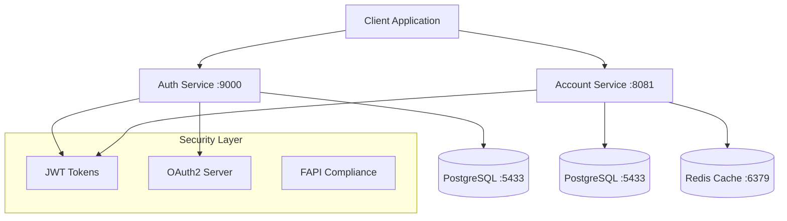

# fintech-api — Secure Financial Services Platform

A production-ready fintech API platform with OAuth2 authorization, account management, and comprehensive security features.

## Architecture



## Services

- **auth-service** (Port 9000): OAuth2 authorization server with FAPI compliance
- **account-service** (Port 8081): Account management and balance operations
- **libs/commons**: Shared security, validation, and utility components

## Quick Start

### Requirements
- Java 17+
- Gradle 8+
- Docker & Docker Compose
- PostgreSQL client (for troubleshooting)

### Setup

1. **Clone and build**:
```bash
git clone <repo-url>
cd fintech-api
./gradlew build
```

2. **Start database**:
```bash
# Start PostgreSQL on port 5433 (avoids local PostgreSQL conflicts)
docker run -d --name fintech-postgres \
  -e POSTGRES_DB=fintech \
  -e POSTGRES_USER=fintech \
  -e POSTGRES_PASSWORD=fintech_dev_password_2024 \
  -p 5433:5432 postgres:14
```

3. **Set environment variables**:
```bash
export JAVA_HOME=/opt/homebrew/opt/openjdk@17/libexec/openjdk.jdk/Contents/Home
export PATH=$JAVA_HOME/bin:$PATH
export DB_HOST=localhost
export DB_PORT=5433
export DB_USERNAME=fintech
export DB_PASSWORD=fintech_dev_password_2024
export ACCOUNT_DB_NAME=fintech
export JWT_SECRET=your-super-secure-jwt-secret-key-at-least-256-bits-long-for-production-use
export ENCRYPTION_KEY=your-32-character-encryption-key-here
```

4. **Start services**:
```bash
# Terminal 1: Auth Service
./gradlew :services:auth-service:bootRun

# Terminal 2: Account Service  
./gradlew :services:account-service:bootRun
```

### API Endpoints

- **Auth Service**: `http://localhost:9000`
  - OAuth2 endpoints: `/.well-known/oauth-authorization-server`
  - Token endpoint: `/oauth2/token`
  
- **Account Service**: `http://localhost:8081`
  - Balance: `GET /v1/accounts/{id}/balance`
  - Health: `GET /actuator/health`

## Troubleshooting

### Database Connection Issues

**Problem**: `FATAL: role "fintech" does not exist`

**Cause**: Local PostgreSQL conflicts with Docker container

**Solution**:
```bash
# Check what's running on port 5432
lsof -i :5432

# Stop local PostgreSQL if running
brew services stop postgresql@14

# Use port 5433 for Docker PostgreSQL
docker run -d --name fintech-postgres \
  -e POSTGRES_DB=fintech \
  -e POSTGRES_USER=fintech \
  -e POSTGRES_PASSWORD=fintech_dev_password_2024 \
  -p 5433:5432 postgres:14

# Test connection
PGPASSWORD=fintech_dev_password_2024 psql -h localhost -p 5433 -U fintech -d fintech -c "SELECT version();"
```

### Port Conflicts

**Problem**: `Port 8081 was already in use`

**Solution**:
```bash
# Find process using port
lsof -i :8081

# Kill process (replace PID)
kill -9 <PID>

# Or use different port
export SERVER_PORT=8082
```

### Spring Security Configuration

**Problem**: `Can't configure mvcMatchers after anyRequest`

**Solution**: Fixed in SecurityConfig - specific matchers must come before `anyRequest()`

### Build Issues

**Problem**: Compilation errors in multiple services

**Solution**:
```bash
# Clean build
./gradlew clean build

# Check Java version
java -version  # Should be 17+

# Exclude problematic modules temporarily
# (mobile-sdk excluded in settings.gradle.kts)
```

## Security Features

- OAuth2 Authorization Server with PKCE
- JWT token-based authentication
- FAPI (Financial-grade API) compliance stubs
- SQL injection prevention with parameterized queries
- Input validation and sanitization
- Rate limiting and request throttling
- Comprehensive audit logging

## Development

### Environment Files

Create `.env` for local development:
```bash
# Database Configuration
POSTGRES_DB=fintech
POSTGRES_USER=fintech
POSTGRES_PASSWORD=fintech_dev_password_2024

# Application Configuration  
JWT_SECRET=fintech_jwt_secret_key_2024_development_only
ENCRYPTION_KEY=fintech_encryption_key_2024_dev_32chars

# Database Connection
DB_HOST=localhost
DB_PORT=5433
DB_USERNAME=fintech
DB_PASSWORD=fintech_dev_password_2024
```

### Code Quality

Run security analysis:
```bash
# Full security scan (requires Amazon Q)
# Identifies SQL injection, hardcoded credentials, etc.
```

## Production Deployment

⚠️ **Security Checklist**:
- [ ] Replace default JWT secrets
- [ ] Use proper certificate-based mTLS
- [ ] Enable HTTPS/TLS everywhere
- [ ] Configure proper database credentials
- [ ] Set up monitoring and alerting
- [ ] Review and fix all security vulnerabilities
- [ ] Enable audit logging
- [ ] Configure rate limiting

## Contributing

This is a development scaffold. Extend with:
- Full FAPI-compliant authorization server
- Database migrations with Flyway
- Bank adapter integrations
- Comprehensive contract tests
- Production monitoring and observability
